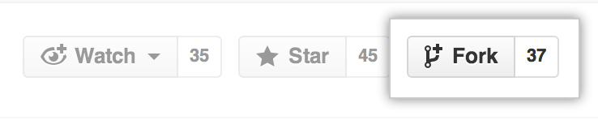

# Contribution Guidelines

You an add any important paper from any field of Computer Science in this repository using 
the following guidelines. 

To contribute follow the below guidelines:

### 1. Fork this Repository


### 2. Clone the repository from your profile
```bash
git clone your-github-user-name/cs-papers
cd cs-papers
```

### 3. Add links in the `README.md` file 
Create a separate branch on your machine for the changes you wish to make as follows:

```bash
git checkout -b branch-name
```

Some good branch names could be _cv-paper_, _bio-tech-mit-paper_,  etc.

Say you wish to add an important paper on the field of image segmentation
in Video Sequences, but there is no Section for Computer Vision and furthermore no sub-section 
for image segmentation in video sequences, then you can simply create a new section called
_Computer Vision_ under _Overview_ and add the sub section _Video Segmentation_ under _Computer Vision_
in the `README.md`  file.

Add your paper link as 

```markdown
1. [paper title](paper-link)
```

Add this link under all other links and please do not insert your link in the middle of the list. 
Thank you :smile:.

### 4. Commit and Push Changes

```bash
git add .
git commit -m "good commit message <50 chars"
git push -u origin branch-name
```

### 5. Create Pull Request

Open the forked repository on GitHub at 
`https://github.com/your-github-user-name/cs-papers`
and choose your newly created branch from the 
_branches & Tags_ dropdown menu.
 
 Then simply click on __Create Pull Request__ and voila job done !

### 6. Aftermath

Once your pull request has been approved and merged the master branch at `anishLearnsToCode/cs-papers`
will be ahead of your forked repo at `your-github-username/cs-papers`. To fix this you need to
add another remote to the official repo and match your local repo using that. 

```bash
cd placement-resources
git checkout master
git remote add destiny https://github.com/anishLearnsToCode/cs-papers.git
git pull --rebase destiny master 
git push origin master 
```

This will bring you repository at `your-github-username/cs-papers` up to date with 
`anishLearnsToCode/cs-papers`
